<div align="center">


[](https://git.io/typing-svg)

<a href="https://www.linkedin.com/in/bhanu-teja-komma-4b5547293/"></a>
<a href="mailto:bhanu0005a@gmail.com"></a>
<a href="https://leetcode.com/u/GB2023002633/"></a>
<a href="https://github.com/maczeo11"></a>


</div>

<br/>

## About

```yaml
name:      Bhanu Teja Komma
role:      Backend Engineer — Cloud-Native / Distributed Systems
focus:     Go, Rust, FastAPI, AWS, Kafka, Spring Boot, React, Docker, Kubernetes, PyTorch
location:  Bengaluru, India
openTo:    Backend / cloud-native / platform roles
currently: Building event-driven platforms; exploring RAG architectures; hardening Linux systems
```

I build backend systems where the interesting part isn't the CRUD — it's what happens when two requests race each other. Most of my time lives inside **AWS** (Lambda, DynamoDB, EventBridge, CDK, Step Functions), **Kafka** for event streaming, and **Postgres/Redis** for data — thinking through idempotency, optimistic locking, single-table design, and event-driven workflows instead of bolting them on after something breaks in production.

Recent work spans:
- **Serverless approval workflow engine** — 6 modules, 36 Lambda handlers, frozen event contracts across 5 partner teams; correctness under concurrent access was the design brief
- **FEI-1000 scoring engine** — 9 weighted clusters, 70 rubric parameters, append-only contribution ledger; output feeds accreditation, so every number must be explainable years later
- **Event-driven Go/Kafka services** — transactional outbox → Mongo Change Streams → Kafka → gRPC/FFmpeg workers; Redis `SETNX` idempotency on payments
- **Spring Boot JVM services** — DI, transaction boundaries, domain-driven structure
- **React/TypeScript frontends** — when the backend needs a UI

The common thread: distributed systems that stay correct under load, with observable, explainable state.

<br/>

## Tech Stack

**Core**


**Backend & Data — what I lean on**


<sub>Go for the hot path, FastAPI when Python fits, Postgres when I need a real database, Redis for the speed layer, Kafka for event streaming.</sub>

**AWS & Infrastructure**


-FF9900?style=flat-square&logo=amazonaws&logoColor=white)


**JVM / Spring**


<sub>Spring Boot for JVM services — dependency injection, transaction boundaries, and the ecosystem.</sub>

**Frontend**


<sub>React + TypeScript when the backend needs a UI.</sub>

**Languages I Reach For**


<sub>Rust for systems-level projects — for the fun of it.</sub>

**Tools & Workflow**


**Deep Learning**


<sub>RAG pipelines (LangChain/LlamaIndex), vector search, embedding models — applied LLMs when the problem calls for it.</sub>

<br/>


> **Open source by default.** If it's not a secret, it's public — issues, PRs, and docs welcome.

<br/>


## Linux Admin Toolkit

<p align="center">


</p>

<sub>Daily drivers: systemd for services, firewalld/nftables for network policy, podman for containers, kubectl for managed K8s (EKS/GKE), Terraform for IaC, tmux/fzf/rg in the terminal.</sub>

<br/>


## Distributed Systems Toolkit

<p align="center">


</p>

<sub>Event streaming with Kafka, gRPC+Protobuf for service contracts, Grafana dashboards + Elasticsearch for observability, Redis Cluster for distributed caching.</sub>

<br/>


<div align="center">

</div>

<br/>


## The Linux Tinkerer

<div align="center">

</div>

<br/>

Rolling-release, x86-64-v4, systemd at PID 1. When I'm not shipping serverless APIs, I'm the guy in `/usr/src/linux` making the box run faster.

**The rig:**

```text
OS:        CachyOS x86-64-v4
KERNEL:    6.x-cachyos
SHELL:     zsh
DE:        KDE Plasma 6
INIT:      systemd (PID 1)
FIREWALL:  firewalld
TUNING:    bpftune (eBPF)
PACKAGES:  ~2000 (pacman)
```

**Badges:**

<p align="center">


</p>

**Things I've tinkered with**

- systemd timer replacing cron (`OnCalendar=*-*-* 03:00:00`, `Persistent=true`)
- bpftune auto-tuning TCP congestion control — it chose BBR
- firewalld zone juggling — default is `home`, work happens in `dmz`
- Plasma KDE theming until 3 AM (and breaking it, then fixing it)
- CachyOS repos: x86-64-v4 optimized packages, `-O3 -march=x86-64-v4`
- systemd unit hardening: `NoNewPrivileges=yes`, `ProtectSystem=strict`, `PrivateTmp=yes`
- eBPF programs for custom observability — because `perf` isn't enough

<br/>

<div align="center">

</div>

<br/>

## What I Actually Think About

<table>
<tr><td width="30%"><b>Idempotency</b></td><td>Designing writes so a Lambda retry can't double-create or double-charge anything.</td></tr>
<tr><td><b>Optimistic locking</b></td><td>Version-checked conditional writes so two approvers racing the same record don't silently clobber each other.</td></tr>
<tr><td><b>Single-table DynamoDB design</b></td><td>Modeling access patterns first, then collapsing entities into one table with GSIs instead of one table per entity.</td></tr>
<tr><td><b>Event-driven workflows</b></td><td>EventBridge as the backbone for state changes, instead of services polling each other for status.</td></tr>
<tr><td><b>Multi-tenant isolation</b></td><td>Scoping every query by role and campus at the auth layer, not trusting the client to ask nicely.</td></tr>
<tr><td><b>Policy as data</b></td><td>Encoding business rules as a registry the code interprets, so a policy change is a data edit and the API contract can be generated from the same source the engine runs on.</td></tr>
<tr><td><b>Explainable state</b></td><td>Keeping an append-only record of <i>why</i> a number is what it is — a running balance can't answer questions six months later, and the inputs can't be reconstructed after the fact.</td></tr>
</table>

<br/>

<div align="center">

</div>

<br/>

## Featured Work


<sub>Team repo, private — see the architecture below instead of the source</sub>

The single authority for approval state on every faculty submission across three campuses. If this system is wrong, someone's approval either gets stuck forever or gets approved twice — so correctness under concurrent access was the actual design brief, not a nice-to-have.

<div align="center">

</div>

**The engineering problem:** approvers escalate submissions up a rank ladder, a scheduled Lambda escalates anything past its SLA, and a human can act on a record at the exact moment the escalation cron fires on it. That's a straightforward race condition if you're not careful.

**How it's handled:**
- Workflow creation is idempotent, so a Lambda retry after a timeout can't spin up a duplicate approval chain
- Every state update is optimistic-locked — a version mismatch fails the write instead of silently overwriting a concurrent change
- The escalation ladder is rank-based with cycle checks, so a misconfigured hierarchy can't loop a request back to someone who already approved it
- Auth is Cognito + JWT, scoped by role and campus, so the isolation between campuses is enforced server-side, not assumed client-side

**Result:** hardened through a dedicated review pass that surfaced and fixed 11 correctness/security issues, including an IDOR that let any authenticated user act as any faculty member in any campus.
`TypeScript` `AWS CDK` `Lambda` `DynamoDB` `EventBridge` `Cognito`

<br/>


<div align="center">

</div>

<br/>


Event-driven Go backend for crowdfunding short films — money handled with idempotency guarantees and video transcoding pushed off the request path. Grew out of MagicStream, a movie streaming server whose JWT/httpOnly-cookie auth, MongoDB layer and HTTP Range streaming became the foundation here.

- **Transactional outbox** → Mongo Change Streams → Kafka, driving async FFmpeg/HLS transcoding workers over gRPC (Protobuf)
- **Payments** — Redis `SETNX` idempotency guards on webhooks, so a retried callback can't double-charge or double-credit a pledge
- **Streaming** — MinIO/S3 presigned uploads and HTTP Range serving, so `<video>` seeks without downloading the whole file
- **Production habits** — token-bucket rate limiting (tighter on auth routes), request-ID tracing, `log/slog` structured logs, Docker + Makefile, graceful shutdown

Full API spec, architecture, data model, and security docs live in the repo's `docs/` folder — the standard I hold every project to.

`Go` `Kafka` `gRPC` `Redis` `MongoDB` `JWT` `Docker` — **[Repository →](https://github.com/maczeo11/go-movie-streaming)**

---


Full-stack maintenance-request system for 50+ residents and 15+ admins across 3 campuses — the project I used to get single-table DynamoDB design and CDK-as-IaC right before bringing them to PRAJNA.

- SLA tracking runs on an EventBridge cron firing every 15 minutes, not a human checking a dashboard
- Single-table DynamoDB design with Cognito-backed role-based access
- 100% infrastructure-as-code via AWS CDK (TypeScript) — no console-clicked resources

`TypeScript` `AWS CDK` `DynamoDB` `React` — **[Repository →](https://github.com/maczeo11/serverless-apartment-manager)**


A hybrid extraction pipeline that turns PDFs, Word docs, spreadsheets, images, and HTML into one standardized JSON shape — built to handle the "dark data" problem of documents that don't come pre-structured.

- Strategy pattern on the backend, so adding a new file format doesn't touch existing extractors (Open/Closed Principle)
- Hybrid OCR pipeline: OpenCV preprocessing feeding Tesseract's LSTM engine, for scanned documents that plain text extraction can't touch
- Queue-managed frontend to keep memory bounded on free-tier hosting

`Python` `OpenCV` `Docker` `JavaScript` — **[Repository →](https://github.com/maczeo11/File_extractor)**

<details>
<summary><b>Other projects</b> — smaller in scope, still shipped</summary>
<br/>

- **[TechBot](https://github.com/maczeo11/sys-ai)** — terminal AI agent for IT troubleshooting; LangChain LCEL agent (Groq `llama-3.3-70b`) with live `psutil` diagnostics and whitelisted shell execution (`ping`, `netstat`, `df`).
- **[Tourism Safety App](https://github.com/maczeo11/tourism_safety_app)** — cross-platform Flutter app with a Python backend aggregating traveller safety data.

</details>

<br/>

<div align="center">

</div>

<br/>

## GitHub Activity

<div align="center">


</div>

<div align="center>


</div>

<div align="center">

</div>

<br/>

<div align="center">

</div>

<br/>

<div align="center">

<br/><br/>
<sub>Build systems that scale, write code that lasts.</sub>
</div>
