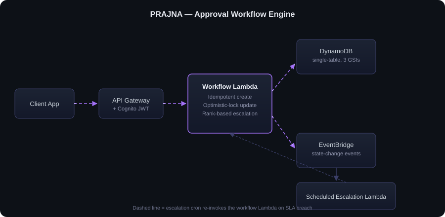

<div align="center">



<br/>
<br/>

[](https://git.io/typing-svg)

<br/>

<a href="https://maczeo.me"></a>
<a href="https://www.linkedin.com/in/bhanu-teja-komma-4b5547293/"></a>
<a href="mailto:bhanu0005a@gmail.com"></a>
<a href="https://leetcode.com/u/GB2023002633/"></a>
<a href="https://github.com/maczeo11"></a>

</div>

<br/>

## About

```yaml
name:      Bhanu Teja Komma
role:      Backend Engineer — Cloud-Native / Distributed Systems
focus:     TypeScript, Go, Python, AWS (Lambda, DynamoDB, EventBridge, CDK), Postgres, MongoDB, Kafka, Redis
exploring: Rust, gRPC, Spring Boot
location:  Bengaluru, India
portfolio: https://maczeo.me
openTo:    Backend / cloud-native / platform roles
currently: Building event-driven platforms on AWS + Postgres/Kafka/Redis
```

I build backend systems where the interesting part isn't the CRUD — it's what happens when two requests race each other. Most of my time lives inside **AWS** (Lambda, DynamoDB, EventBridge, CDK, Step Functions), **Kafka** for event streaming, and **Postgres/Redis** for data — thinking through idempotency, optimistic locking, single-table design, and event-driven workflows instead of bolting them on after something breaks in production.

Recent work spans:
- **Serverless approval workflow engine** — 6 modules, 36 Lambda handlers, frozen event contracts across 5 partner teams; correctness under concurrent access was the design brief
- **Event-driven Go/Kafka services** — transactional outbox → Postgres + Debezium CDC → Kafka → gRPC/FFmpeg workers; `SKIP LOCKED` dispatcher, Redis `SETNX` + Postgres `UNIQUE(provider, provider_event_id)` idempotency on payments — verified via `proofs/cinefund/`
- **Spring Boot JVM services** — DI, transaction boundaries, domain-driven structure
- **React/TypeScript frontends** — when the backend needs a UI

The common thread: distributed systems that stay correct under load, with observable, explainable state.

<br/>

## Tech Stack

| Category | Skills & Tools |
|---|---|
| **Languages** |  |
| **Backend & Data** |  |
| **Frontend** |  |
| **Infra & Tools** |  |
| **Exploring** |  |

<br/>

### AWS Services

<p align="center">


</p>

<p align="center"><sub>Alpine & Arch for lightweight and rolling environments.</sub></p>

<br/>

> **Open source by default.** If it's not a secret, it's public — issues, PRs, and docs welcome.

<br/>

## Linux Admin Toolkit

<p align="center">


</p>

<p align="center"><sub>systemd, firewalld/nftables, podman, kubectl (EKS/GKE), Terraform, tmux/fzf/rg.</sub></p>

<br/>

## Distributed Systems Toolkit

<p align="center">


</p>

<p align="center"><sub>Kafka, gRPC+Protobuf, Grafana, Redis Cluster.</sub></p>

<br/>

<div align="center">

</div>

<br/>

## What I Actually Think About

<details>
<summary><b>7 distributed systems principles I actually apply day-to-day</b> — click to expand</summary>
<br/>

| Principle | Core Practice |
|---|---|
| **Idempotency** | Designing writes so a Lambda retry can't double-create or double-charge anything. |
| **Optimistic locking** | Version-checked conditional writes so two approvers racing the same record don't silently clobber each other. |
| **Single-table DynamoDB design** | Modeling access patterns first, then collapsing entities into one table with GSIs instead of one table per entity. |
| **Event-driven workflows** | EventBridge as the backbone for state changes, instead of services polling each other for status. |
| **Multi-tenant isolation** | Scoping every query by role and campus at the auth layer, not trusting the client to ask nicely. |
| **Policy as data** | Encoding business rules as a registry the code interprets, so a policy change is a data edit and the API contract can be generated from the same source the engine runs on. |
| **Explainable state** | Keeping an append-only record of *why* a number is what it is — a running balance can't answer questions six months later, and the inputs can't be reconstructed after the fact. |

</details>

<br/>

<div align="center">

</div>

<br/>

## Featured Work

### PRAJNA — Approval Workflow Engine

<sub>Team repo, private — see the architecture and engineering breakdown below</sub>

The single authority for approval state on every faculty submission across three campuses. If this system is wrong, someone's approval either gets stuck forever or gets approved twice — so correctness under concurrent access was the actual design brief, not a nice-to-have.

<div align="center">

</div>

<br/>

**The engineering problem:** approvers escalate submissions up a rank ladder, a scheduled Lambda escalates anything past its SLA, and a human can act on a record at the exact moment the escalation cron fires on it. That's a straightforward race condition if you're not careful.

**How it's handled:**
- Workflow creation is idempotent, so a Lambda retry after a timeout can't spin up a duplicate approval chain
- Every state update is optimistic-locked — a version mismatch fails the write instead of silently overwriting a concurrent change
- The escalation ladder is rank-based with cycle checks, so a misconfigured hierarchy can't loop a request back to someone who already approved it
- Auth is Cognito + JWT, scoped by role and campus, so the isolation between campuses is enforced server-side, not assumed client-side

**Result:** hardened through a dedicated review pass that surfaced and fixed 11 correctness/security issues, including an IDOR that let any authenticated user act as any faculty member in any campus.

<p>


</p>

<details>
<summary><b>Proof — Single-Table DynamoDB Schema & Access Patterns (AWS CDK)</b></summary>
<br/>

```typescript
// proofs/prajna/cdk-snippet.txt (AWS CDK in TypeScript)
const requestsTable = new dynamodb.Table(this, 'RequestsTable', {
  tableName: `maintenance-requests-${stage}`,
  partitionKey: { name: 'PK', type: dynamodb.AttributeType.STRING },
  sortKey:      { name: 'SK', type: dynamodb.AttributeType.STRING },
  billingMode:  dynamodb.BillingMode.PAY_PER_REQUEST,
  timeToLiveAttribute: 'ttl',
  removalPolicy: isProd ? cdk.RemovalPolicy.RETAIN : cdk.RemovalPolicy.DESTROY,
});

// GSI 1: Query all requests filed by a specific resident (PK=residentId, SK=createdAt)
requestsTable.addGlobalSecondaryIndex({
  indexName:    'ResidentIndex',
  partitionKey: { name: 'residentId', type: dynamodb.AttributeType.STRING },
  sortKey:      { name: 'createdAt',  type: dynamodb.AttributeType.STRING },
});

// GSI 2: SLA Escalation worker query (PK=status, SK=slaDeadline)
requestsTable.addGlobalSecondaryIndex({
  indexName:    'StatusIndex',
  partitionKey: { name: 'status',      type: dynamodb.AttributeType.STRING },
  sortKey:      { name: 'slaDeadline', type: dynamodb.AttributeType.STRING },
});
```

<sub>Full CDK construct & architecture verification in [`proofs/prajna/`](proofs/prajna/)</sub>
</details>

<br/>

<div align="center">

</div>

<br/>

### CineFund — Crowdfunding & Streaming

Event-driven Go backend for crowdfunding short films — money path built before video with **Postgres + Kafka + Redis**, inspired by MagicStream (movie streaming foundation with JWT/httpOnly-cookie auth and HTTP Range streaming).

<div align="center">

</div>

<br/>

- **Transactional outbox** → Postgres + Debezium CDC — domain write + outbox insert in one TX, `SKIP LOCKED` dispatcher → Kafka, driving async FFmpeg/HLS transcoding workers over gRPC (Protobuf) — see [`proofs/cinefund/0013_outbox.up.sql`](proofs/cinefund/0013_outbox.up.sql) + [`proofs/cinefund/README.md`](proofs/cinefund/README.md)
- **Payments** — Redis `SETNX` (24h TTL, `idem:wh:<eventID>`) in front of Postgres `UNIQUE(provider, provider_event_id)` ([`proofs/cinefund/0008_payment_events.up.sql`](proofs/cinefund/0008_payment_events.up.sql)) — 50 concurrent webhooks → 1 success / 49 `ErrDuplicateEvent` ([`proofs/cinefund/idempotency-50concurrent.txt`](proofs/cinefund/idempotency-50concurrent.txt)), double-entry ledger ([`proofs/cinefund/0011_ledger.up.sql`](proofs/cinefund/0011_ledger.up.sql))
- **Streaming** — MinIO/S3 presigned uploads and HTTP Range serving, so `<video>` seeks without downloading the whole file
- **Production habits** — token-bucket rate limiting (tighter on auth routes), request-ID tracing, `log/slog` structured logs, Docker + Makefile, graceful shutdown

Full API spec, architecture, data model, and security docs live in the repo's `docs/` folder — the standard I hold every project to.

<p>


&nbsp; <b><a href="https://github.com/maczeo11/cinefund">Repository →</a></b>
</p>

<details>
<summary><b>Proof — Outbox Table Schema + SKIP LOCKED Dispatcher Query</b></summary>
<br/>

```sql
-- proofs/cinefund/0013_outbox.up.sql
CREATE TABLE outbox (
    id             BIGINT GENERATED ALWAYS AS IDENTITY PRIMARY KEY,
    event_id       UUID NOT NULL UNIQUE,        -- dedupe key for Kafka consumers
    event_type     TEXT NOT NULL,               -- 'pledge.captured'
    event_version  INTEGER NOT NULL DEFAULT 1,
    aggregate_type TEXT NOT NULL,               -- 'pledge'
    aggregate_id   UUID NOT NULL,               -- Kafka partition key
    payload        JSONB NOT NULL,
    trace_id       TEXT,                        -- W3C traceparent
    created_at     TIMESTAMPTZ NOT NULL DEFAULT now(),
    published_at   TIMESTAMPTZ,
    attempts       INTEGER NOT NULL DEFAULT 0,
    last_error     TEXT
);

-- Monotonic integer scan of unpublished rows (only scans unhandled events)
CREATE INDEX idx_outbox_unpublished ON outbox (id) WHERE published_at IS NULL;

-- Dispatcher worker query (SKIP LOCKED guarantees concurrent worker safety without deadlock)
SELECT id, payload FROM outbox WHERE published_at IS NULL ORDER BY id LIMIT 50 FOR UPDATE SKIP LOCKED;
```

<sub>Full migration DDL, ledger, and 50x concurrent test outputs in [`proofs/cinefund/`](proofs/cinefund/)</sub>
</details>

---

### Serverless Apartment Maintenance Portal

Full-stack maintenance-request system for 50+ residents and 15+ admins across 3 campuses — the project I used to get single-table DynamoDB design and CDK-as-IaC right before bringing them to PRAJNA.

- SLA tracking runs on an EventBridge cron firing every 15 minutes, not a human checking a dashboard
- Single-table DynamoDB design with Cognito-backed role-based access
- 100% infrastructure-as-code via AWS CDK (TypeScript) — no console-clicked resources

<p>


&nbsp; <b><a href="https://github.com/maczeo11/serverless-apartment-manager">Repository →</a></b>
</p>

<br/>

### Universal Text Extractor

A hybrid extraction pipeline that turns PDFs, Word docs, spreadsheets, images, and HTML into one standardized JSON shape — built to handle the "dark data" problem of documents that don't come pre-structured.

- Strategy pattern on the backend, so adding a new file format doesn't touch existing extractors (Open/Closed Principle)
- Hybrid OCR pipeline: OpenCV preprocessing feeding Tesseract's LSTM engine, for scanned documents that plain text extraction can't touch
- Queue-managed frontend to keep memory bounded on free-tier hosting

<p>


&nbsp; <b><a href="https://github.com/maczeo11/File_extractor">Repository →</a></b>
</p>

<details>
<summary><b>Proof — Magic-Byte Signature Detection Pipeline</b></summary>
<br/>

```python
# proofs/extractor/magic-snippet.py
def detect_file_type(buffer: bytes) -> str:
    """Identifies true file format from binary magic bytes rather than trusting file extension."""
    if buffer.startswith(b'%PDF'):
        return 'application/pdf'
    if buffer.startswith(b'\x89PNG\r\n\x1a\n'):
        return 'image/png'
    if buffer.startswith(b'\xff\xd8\xff'):
        return 'image/jpeg'
    if buffer.startswith(b'PK\x03\x04'):
        return 'application/vnd.openxmlformats-officedocument' # docx, xlsx
    return 'application/octet-stream'
```

<sub>Full extractor implementation & Otsu binarization pipeline in [`proofs/extractor/`](proofs/extractor/)</sub>
</details>

<br/>

<details>
<summary><b>Other projects</b> — smaller in scope, still shipped</summary>
<br/>

- **[TechBot](https://github.com/maczeo11/sys-ai)** — terminal AI agent for IT troubleshooting; LangChain LCEL agent (Groq `llama-3.3-70b`) with live `psutil` diagnostics and whitelisted shell execution (`ping`, `netstat`, `df`).
- **[go-movie-streaming](https://github.com/maczeo11/go-movie-streaming)** — earlier MagicStream fork (MongoDB + JWT/httpOnly-cookie) that CineFund grew out of; kept as side project.

</details>

<br/>

<div align="center">

</div>

<br/>

## GitHub Activity

<table width="100%">
  <tr>
    <td width="50%" align="center">
      
    </td>
    <td width="50%" align="center">
      
    </td>
  </tr>
</table>

<div align="center">

</div>

<br/>

<div align="center">

<br/><br/>
<sub>Build systems that scale, write code that lasts.</sub>
</div>
